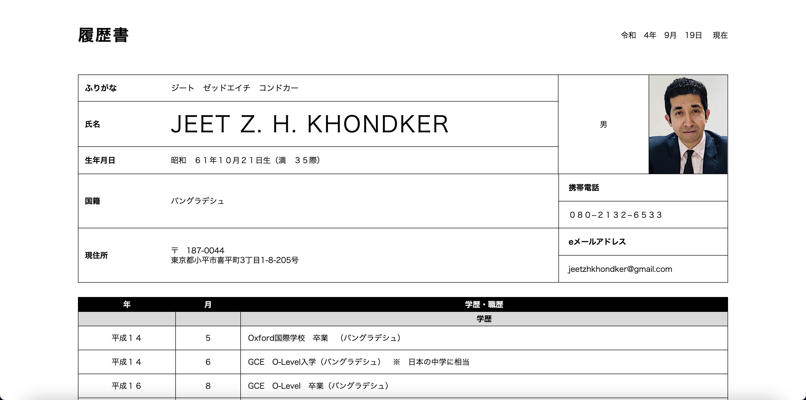

# 履歴書 (Ver. 2.0)

## Overview・概要

**履歴書** is a Website/Cloud version of Japanese resume (履歴書). This is the scond version of the previous repository for Japanese resume that I created from scratch. **履歴書** is fully supported in almost every popular browsers and devices.

## Version・バージョン

2022 年 09 月 19 日　 2.0 - Code refactoring, Full-width screen **履歴書** display

## Features & Functions・特徴と機能

- Current Date Display in Japanese Date Format (令和４　 8 月　 11 日）
- Phone call to the person of the **履歴書** by clicking on the phone number (携帯電話)
- Email Sending to the email address mentioned in the **履歴書**
- Dynamic page adjustment according to devices' width size

## Tools & Technology・特徴と機能

HTML5, CSS3, JavaScript

## How To Use・使用手順

- Clone the repository.
- Open `index.html` file in web browser.

## Author・作成者

Jeet Z. H. Khondker
